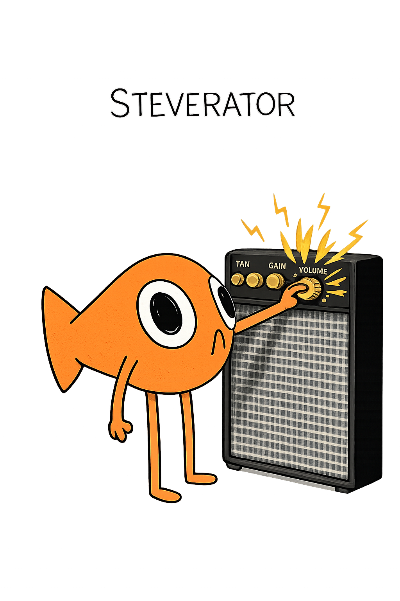

# 🎛️ Steverator — "Le Saturateur à Poisson" 🐟


---

## 📥 Téléchargement / Download

> **🚀 [➡️ Télécharger la dernière version / Download Latest Release](../../releases/latest)**

Visitez la [page des releases](../../releases) pour télécharger le plugin pour macOS ou Windows.

<p align="center">
  
</p>

---

<details>
<summary>🇫🇷 <strong>MANUEL UTILISATEUR (Français)</strong> — Cliquez pour ouvrir</summary>

# 🇫🇷 MANUEL UTILISATEUR

## 🎉 Bienvenue dans le Steverator !

> **Le Steverator est un saturateur multi-bandes fun et puissant** qui va ajouter **chaleur**, **caractère** et **grain** à tous vos sons ! 🔥

Que vous vouliez :
- 🎸 **Réchauffer** une basse molle
- 🎤 **Donner du mordant** à une voix plate  
- 🥁 **Ajouter du punch** à vos drums
- 🎹 **Colorer** un synthé trop propre

...le Steverator est là pour vous ! Avec sa mascotte **Steve le poisson** 🐟 qui bouge au rythme de votre musique, mixer devient encore plus fun !

---

## 🎮 L'Interface en un Coup d'Œil

L'interface est divisée en **4 zones principales** super intuitives :

```
┌─────────────┬─────────────────────┬─────────────────┐
│   🐟 STEVE  │   🎚️ BANDES FREQ   │  🔥 SATURATION  │
│   + INPUT   │   Low/Mid/High      │   + MASTER      │
│   + PRESETS │   Crossovers        │   Wave/Shape    │
└─────────────┴─────────────────────┴─────────────────┘
```

---

## 🎚️ Section 1 : Entrée & Steve (Gauche)

| Contrôle | Description |
|----------|-------------|
| **🔊 Input** | Contrôle le niveau d'entrée (-24dB à +24dB). **Plus c'est fort, plus ça sature !** |
| **🐟 Steve** | Notre mascotte animée ! Il danse avec votre musique 💃 |
| **📁 Presets** | Des préréglages tout faits pour démarrer rapidement |

> 💡 **Astuce** : Montez l'Input pour **attaquer fort** la saturation, ou baissez-le pour un effet plus subtil !

---

## 📊 Section 2 : Bandes de Fréquences (Centre)

Le Steverator divise votre son en **3 bandes indépendantes** :

```
🔈 BASSES ──────┬────── MÉDIUMS ──────┬────── AIGUS 🔊
              Low Freq            High Freq
```

| Contrôle | Ce que ça fait |
|----------|----------------|
| **Low Freq** | Point de séparation Basses/Médiums (en Hz) |
| **High Freq** | Point de séparation Médiums/Aigus (en Hz) |
| **🔥 Low Warmth** | Ajoute une saturation **ronde et chaleureuse** aux basses |
| **✨ High Softness** | Saturation **douce** pour des aigus non-agressifs |
| **📊 Level Low/High** | Volume de sortie de chaque bande |

> 💡 **Astuce** : Voulez-vous des basses massives sans toucher aux aigus ? Montez le **Low Warmth** et gardez le **High Softness** bas !

---

## 🔥 Section 3 : Saturation Globale (Droite)

**C'est ici que la magie opère !** ✨

| Contrôle | Ce que ça fait |
|----------|----------------|
| **🌊 Wave** | Le **type** de distorsion (Tube, Tape, Diode, Fold, etc.) |
| **🎛️ Saturation** | LE gros bouton ! L'**intensité** de l'effet |
| **🔧 Shape** | La **texture** : plus tranchant ou plus rond ? |

### 🌊 Les différents types de Waves :

```
┌──────────────────────────────────────────────────┐
│  🎸 Tube    → Chaleureux, vintage, rock         │
│  📼 Tape    → Doux, compression naturelle       │
│  💡 Diode   → Agressif, mordant, rock/metal     │
│  🔄 Fold    → Créatif, synthwave, expérimental  │
│  📐 Clip    → Digital, brutal, EDM              │
│  ... et plein d'autres !                        │
└──────────────────────────────────────────────────┘
```

---

## 🎯 Section 4 : Master (Droite & Bas)

| Contrôle | Description |
|----------|-------------|
| **🔀 Mix** | Mélange Wet/Dry (0% = original, 100% = saturé) |
| **🔊 Output** | Volume de sortie final |
| **👁️ Delta Monitor** | Écoutez **UNIQUEMENT** la distorsion ajoutée ! |
| **📈 Delta Gain** | Volume du signal Delta |
| **🛡️ Limiter** | Protection contre le clipping numérique |

> 💡 **Pro tip** : Utilisez le **Delta Monitor** pour entendre exactement ce que vous ajoutez au mix. Super utile pour régler finement !

---

## 🚀 Quick Start : Vos Premiers Pas

1. **Chargez le plugin** sur une piste audio
2. **Choisissez un preset** ou partez de zéro
3. **Sélectionnez un Wave** (commencez par "Tube" !)
4. **Montez la Saturation** petit à petit
5. **Ajustez le Mix** à votre goût
6. **Profitez** du son chaud et fuzzy ! 🔥

</details>

---

<details>
<summary>🇬🇧 <strong>USER MANUAL (English)</strong> — Click to expand</summary>

# 🇬🇧 USER MANUAL

## 🎉 Welcome to Steverator!

> **Steverator is a fun and powerful multi-band saturator** that adds **warmth**, **character**, and **grit** to all your sounds! 🔥

Whether you want to:
- 🎸 **Warm up** a thin bass
- 🎤 **Add bite** to a flat vocal
- 🥁 **Punch up** your drums
- 🎹 **Color** a too-clean synth

...Steverator's got you covered! With our dancing mascot **Steve the Fish** 🐟 moving to the beat, mixing becomes even more fun!

**🚀 Quick Start:**
1. Load the plugin → 2. Pick a Wave (try "Tube"!) → 3. Turn up Saturation → 4. Adjust Mix → 5. Enjoy! 🔥

</details>

---

# 🛠️ DEVELOPER DOCUMENTATION

> **Senior-level technical reference for AI agents and developers working on Steverator**

---

## 📋 Table of Contents

1. [Project Overview](#-project-overview)
2. [Architecture Deep Dive](#-architecture-deep-dive)
3. [Complete File Reference](#-complete-file-reference)
4. [Parameter System (20 Parameters)](#-parameter-system-20-parameters)
5. [DSP Signal Flow](#-dsp-signal-flow)
6. [Waveshape Algorithms (28 Types)](#-waveshape-algorithms-28-types)
7. [UI System & Rendering](#-ui-system--rendering)
8. [Build System & Deployment](#-build-system--deployment)
9. [Common Tasks & Patterns](#-common-tasks--patterns)

---

## 🎯 Project Overview

```
┌─────────────────────────────────────────────────────────────────┐
│  STEVERATOR — Multi-Band Saturation VST3 Plugin                │
├─────────────────────────────────────────────────────────────────┤
│  Language:     C++17                                            │
│  Framework:    JUCE 7.x                                         │
│  Format:       VST3, Standalone                                 │
│  Platforms:    macOS (Universal: ARM64 + x86_64), Windows x64   │
│  Architecture: MVC (Model-View-Controller)                      │
│  Lines of Code: ~2,500 (Source only)                            │
└─────────────────────────────────────────────────────────────────┘
```

### 🔑 Key Features
- **3-Band Crossover** using Linkwitz-Riley filters (flat phase response)
- **28 Waveshape Algorithms** (Tube, Tape, Diode, Fuzz, Chebyshev, etc.)
- **4x Oversampling** for alias-free saturation
- **Delta Monitor** for isolating added harmonics
- **Smooth Crossfades** (10ms) for click-free parameter changes
- **Animated Mascot** reacting to audio RMS level
- **Procedural UI** (no image-based knobs)

---

## 🏗 Architecture Deep Dive

### Model-View-Controller Pattern

```
┌──────────────────────────────────────────────────────────────────────┐
│                        JUCE PLUGIN ARCHITECTURE                      │
├──────────────────────────────────────────────────────────────────────┤
│                                                                      │
│   ┌─────────────────────────────────────────────────────────────┐   │
│   │  MODEL: AudioProcessorValueTreeState (APVTS)                │   │
│   │  ══════════════════════════════════════════════════════════ │   │
│   │  • Single source of truth for 20 parameters                 │   │
│   │  • Thread-safe atomic access                                │   │
│   │  • Automatic DAW automation support                         │   │
│   │  • XML serialization for presets                            │   │
│   │  • Location: PluginProcessor.h → `apvts` member             │   │
│   └─────────────────────────────────────────────────────────────┘   │
│                              │                                       │
│              ┌───────────────┴───────────────┐                      │
│              ▼                               ▼                      │
│   ┌─────────────────────┐         ┌─────────────────────┐           │
│   │  CONTROLLER (DSP)   │         │  VIEW (UI)          │           │
│   │  PluginProcessor    │         │  PluginEditor       │           │
│   │  ═══════════════════│         │  ════════════════════│          │
│   │  • processBlock()   │◄───────►│  • paint()          │           │
│   │  • prepareToPlay()  │  APVTS  │  • resized()        │           │
│   │  • 3-Band Crossover │  Link   │  • timerCallback()  │           │
│   │  • Oversampling     │         │  • Attachments      │           │
│   │  • Waveshaping      │         │  • CustomLookAndFeel│           │
│   └─────────────────────┘         └─────────────────────┘           │
│                                                                      │
└──────────────────────────────────────────────────────────────────────┘
```

### Thread Safety Model

```cpp
// AUDIO THREAD (Real-time, ~44100 calls/sec)
processBlock() {
    // ✅ ALLOWED: Atomic reads, stack allocation, SIMD ops
    float value = *apvts.getRawParameterValue("drive");
    
    // ❌ FORBIDDEN: new, malloc, mutex, file I/O, logging
}

// MESSAGE THREAD (UI, ~30-60 fps)
timerCallback() {
    // ✅ ALLOWED: Atomic reads from processor
    float rms = processor.currentRMSLevel.load();
    
    // ✅ ALLOWED: Heap allocation for display
    repaint();
}
```

---

## 📁 Complete File Reference

### Project Root

| File | Size | Purpose |
|------|------|---------|
| `CMakeLists.txt` | 4.7 KB | **Build config**: JUCE setup, plugin metadata, linking |
| `build_and_deploy.sh` | 3.9 KB | **Master script**: Build, sign, deploy, cache clear |
| `build_and_test.sh` | 1.8 KB | Quick test build without deployment |
| `README.md` | ~13 KB | This documentation |
| `AGENTS.md` | 9.7 KB | AI agent instructions |
| `TUTORIAL.md` | 3.9 KB | Learning guide |
| `LICENSE` | 1.1 KB | MIT License |

### Source Directory (`Source/`)

#### 📄 `PluginProcessor.h` (127 lines)
```cpp
class Vst_saturatorAudioProcessor : public juce::AudioProcessor {
public:
    // === LIFECYCLE ===
    Vst_saturatorAudioProcessor();
    ~Vst_saturatorAudioProcessor() override;
    
    // === DSP CORE ===
    void prepareToPlay(double sampleRate, int samplesPerBlock) override;
    void processBlock(juce::AudioBuffer<float>&, juce::MidiBuffer&) override;
    void releaseResources() override;
    
    // === STATE ===
    void getStateInformation(juce::MemoryBlock& destData) override;
    void setStateInformation(const void* data, int sizeInBytes) override;
    
    // === PUBLIC DATA ===
    juce::AudioProcessorValueTreeState apvts;  // Parameter tree
    
    // Visualizer circular buffer (512 samples)
    static const int visualizerBufferSize = 512;
    std::array<float, visualizerBufferSize> visualizerBuffer;
    std::atomic<int> visualizerWriteIndex{0};
    
    // Envelope follower for Steve animation
    std::atomic<float> currentRMSLevel{0.0f};

private:
    // === DSP MEMBERS ===
    using Filter = juce::dsp::LinkwitzRileyFilter<float>;
    Filter lp1, hp1, lp2, hp2;  // 4 filters for 3-band split
    
    juce::AudioBuffer<float> lowBuffer, midBuffer, highBuffer;
    juce::dsp::Limiter<float> limiter;
    juce::dsp::Oversampling<float> oversampling;  // 4x, polyphase IIR
    
    // Delta crossfade state
    float deltaSmoothed = 0.0f;
    float deltaCrossfadeStep = 0.0f;  // Calculated for 10ms fade
};
```

#### 📄 `PluginProcessor.cpp` (707 lines)

**Key Functions:**

| Function | Lines | Description |
|----------|-------|-------------|
| `createParameterLayout()` | 42-148 | Defines all 20 parameters with ranges |
| `prepareToPlay()` | 204-244 | Initialize DSP, filters, oversampling |
| `processBlock()` | 265-669 | **MAIN DSP LOOP** - All audio processing |
| `getStateInformation()` | 681-689 | Serialize state to XML |
| `setStateInformation()` | 691-700 | Deserialize state from XML |

**processBlock() Detailed Flow:**
```
Line 265-669: processBlock()
├── 276-311: Read all 20 parameter values (atomic)
├── 317-323: Input gain staging + dry buffer copy
├── 325-335: Update crossover filter coefficients (if changed)
├── 343-403: processBands() lambda - 3-band split & per-band processing
├── 406-540: applyWaveshape() lambda - 28 waveshape algorithms
├── 542-584: Pre/Post routing (Saturation→EQ or EQ→Saturation)
├── 596-627: Delta monitor crossfade mixing
├── 630-635: Output gain + optional limiter
├── 637-668: Visualizer buffer write + RMS calculation
```

#### 📄 `PluginEditor.h` (183 lines)
```cpp
class Vst_saturatorAudioProcessorEditor : public juce::AudioProcessorEditor,
                                          private juce::Timer {
public:
    Vst_saturatorAudioProcessorEditor(Vst_saturatorAudioProcessor&);
    ~Vst_saturatorAudioProcessorEditor() override;
    
    void paint(juce::Graphics&) override;
    void resized() override;
    void timerCallback() override;

private:
    // === DESIGN CONSTANTS ===
    static constexpr int DESIGN_WIDTH = 1300;
    static constexpr int DESIGN_HEIGHT = 850;
    float scaleFactor = 1.0f;
    
    // === UI COMPONENTS ===
    // A. Global Saturation
    juce::Slider saturationSlider, shapeSlider;
    juce::ComboBox waveshapeCombo;
    
    // B. Low Band
    juce::ToggleButton lowEnableButton;
    juce::Slider lowFreqSlider, lowWarmthSlider, lowLevelSlider;
    
    // C. High Band
    juce::ToggleButton highEnableButton;
    juce::Slider highFreqSlider, highSoftnessSlider, highLevelSlider;
    
    // D. Gain & Routing
    juce::Slider inputGainSlider, mixSlider, outputGainSlider;
    juce::ToggleButton prePostButton, limiterButton, bypassButton;
    
    // E. Delta Monitoring
    juce::ToggleButton deltaButton;
    juce::Slider deltaGainSlider;
    
    // F. Preset System
    juce::ComboBox presetsCombo;
    juce::TextButton presetLeftBtn{"<"}, presetRightBtn{">"};
    std::vector<PresetData> presets;
    
    // G. Styling
    CustomLookAndFeel customLookAndFeel;
    juce::Image steveImage, steve2Image;
    juce::TooltipWindow tooltipWindow;
};
```

#### 📄 `PluginEditor.cpp` (975 lines)

**Key Functions:**

| Function | Lines | Description |
|----------|-------|-------------|
| `Constructor` | 14-308 | Initialize all 25+ UI components, attachments, tooltips |
| `scaleDesignBounds()` | 312-323 | Scale fixed design to any window size |
| `paint()` | 325-478 | Draw background, Steve, waveform, labels |
| `resized()` | 480-641 | Position all components using scaled coordinates |
| `timerCallback()` | 643-715 | Update waveform, Steve animation (30fps) |
| `initializePresets()` | 821-1020 | Define 76 factory presets |
| `applyPreset()` | 856-907 | Apply preset values to sliders |
| `loadImage()` | 944-974 | Load images from BinaryData or filesystem |

#### 📄 `CustomLookAndFeel.h` (96 lines)
```cpp
class CustomLookAndFeel : public juce::LookAndFeel_V4 {
public:
    CustomLookAndFeel();
    
    // Resource loading
    void ensureImageLoaded();
    void ensureFontLoaded();
    juce::Font getCustomFont(float height, int style = juce::Font::plain);
    
    // Component drawing overrides
    void drawRotarySlider(...) override;      // Procedural knobs
    void drawToggleButton(...) override;      // Glowy toggle buttons
    void drawComboBox(...) override;          // Styled dropdowns
    void drawTooltip(...) override;           // Orange tooltips
    void drawPopupMenuItem(...) override;     // Menu styling
    void drawButtonText(...) override;        // Navigation arrows

private:
    juce::Image indicatorImage;
    juce::Typeface::Ptr customTypeface;
};
```

#### 📄 `CustomLookAndFeel.cpp` (621 lines)

**Key Functions:**

| Function | Lines | Description |
|----------|-------|-------------|
| `ensureFontLoaded()` | 56-84 | Load NanumPenScript from BinaryData |
| `drawRotarySlider()` | 100-285 | **Main knob rendering** - concentric rings, gradient arc |
| `HoverLabel` class | 302-341 | Interactive text box with hover effects |
| `drawToggleButton()` | 381-432 | Glowing orange toggle buttons |
| `drawPopupMenuItem()` | 522-567 | Custom menu item colors |

### Assets Directory (`Assets/`)

| File | Size | Format | Usage |
|------|------|--------|-------|
| `NanumPenScript-Regular.ttf` | 3.2 MB | TrueType | Custom handwriting font |
| `steve.png` | 2.3 MB | PNG | Mascot (closed mouth) |
| `steve2.png` | 2.2 MB | PNG | Mascot (open mouth - talking) |
| `indicator.png` | 2 KB | PNG | Knob position dot |
| `background.png` | 2.4 MB | PNG | (Legacy, not currently used) |
| `version.txt` | 26 B | Text | Build hash + timestamp |

---

## 🎛 Parameter System (20 Parameters)

### Complete Parameter Reference

```cpp
// A. GLOBAL SATURATION (3 params)
┌──────────────┬────────────────┬─────────────┬─────────────┬──────────┐
│ ID           │ Name           │ Min         │ Max         │ Default  │
├──────────────┼────────────────┼─────────────┼─────────────┼──────────┤
│ drive        │ Saturation     │ 0.0         │ 24.0 dB     │ 0.0      │
│ shape        │ Shape          │ 0.0         │ 1.0         │ 0.0      │
│ waveshape    │ Waveshape      │ 0           │ 57 (choice) │ 0 (Tube) │
└──────────────┴────────────────┴─────────────┴─────────────┴──────────┘

// B. LOW BAND (4 params)
┌──────────────┬────────────────┬─────────────┬─────────────┬──────────┐
│ lowEnable    │ Low Enable     │ false       │ true        │ false    │
│ lowFreq      │ Low Freq       │ 20 Hz       │ 1000 Hz     │ 200 Hz   │
│ lowWarmth    │ Low Warmth     │ 0.0         │ 1.0         │ 0.0      │
│ lowLevel     │ Low Level      │ -24 dB      │ +24 dB      │ 0.0      │
└──────────────┴────────────────┴─────────────┴─────────────┴──────────┘

// C. HIGH BAND (4 params)
┌──────────────┬────────────────┬─────────────┬─────────────┬──────────┐
│ highEnable   │ High Enable    │ false       │ true        │ false    │
│ highFreq     │ High Freq      │ 1000 Hz     │ 20000 Hz    │ 5000 Hz  │
│ highSoftness │ High Softness  │ 0.0         │ 1.0         │ 0.0      │
│ highLevel    │ High Level     │ -24 dB      │ +24 dB      │ 0.0      │
└──────────────┴────────────────┴─────────────┴─────────────┴──────────┘

// D. GAIN & ROUTING (6 params)
┌──────────────┬────────────────┬─────────────┬─────────────┬──────────┐
│ inputGain    │ Input Gain     │ -24 dB      │ +24 dB      │ 0.0      │
│ mix          │ Mix            │ 0%          │ 100%        │ 100%     │
│ output       │ Output Gain    │ -24 dB      │ +24 dB      │ 0.0      │
│ prePost      │ Pre/Post       │ false       │ true        │ false    │
│ limiter      │ Limiter        │ false       │ true        │ true     │
│ bypass       │ Bypass         │ false       │ true        │ false    │
└──────────────┴────────────────┴─────────────┴─────────────┴──────────┘

// E. DELTA MONITORING (2 params)
┌──────────────┬────────────────┬─────────────┬─────────────┬──────────┐
│ delta        │ Delta          │ false       │ true        │ false    │
│ deltaGain    │ Delta Gain     │ -24 dB      │ 0 dB        │ -12 dB   │
└──────────────┴────────────────┴─────────────┴─────────────┴──────────┘
```

### Parameter Access Pattern
```cpp
// In processBlock() - Real-time safe
float saturation = *apvts.getRawParameterValue("drive");
bool bypass = *apvts.getRawParameterValue("bypass");

// In Editor - Via Attachments
saturationAttachment = std::make_unique<SliderAttachment>(
    processor.apvts, "drive", saturationSlider);
```

---

## 🔊 DSP Signal Flow

### Complete Audio Path

```
┌─────────────────────────────────────────────────────────────────────────┐
│                          AUDIO INPUT (Stereo)                           │
└─────────────────────────────────────────────────────────────────────────┘
                                    │
                                    ▼
┌─────────────────────────────────────────────────────────────────────────┐
│  1. BYPASS CHECK                                                        │
│     if (bypass) return; // Early exit, no processing                    │
└─────────────────────────────────────────────────────────────────────────┘
                                    │
                                    ▼
┌─────────────────────────────────────────────────────────────────────────┐
│  2. DRY BUFFER COPY                                                     │
│     dryBuffer.makeCopyOf(buffer);  // For wet/dry mix later             │
└─────────────────────────────────────────────────────────────────────────┘
                                    │
                                    ▼
┌─────────────────────────────────────────────────────────────────────────┐
│  3. INPUT GAIN                                                          │
│     buffer.applyGain(inputGain);  // -24dB to +24dB                     │
└─────────────────────────────────────────────────────────────────────────┘
                                    │
                    ┌───────────────┴───────────────┐
                    │                               │
            prePost = false                 prePost = true
           (Pre: Sat→EQ)                   (Post: EQ→Sat)
                    │                               │
                    ▼                               ▼
┌────────────────────────────┐      ┌────────────────────────────┐
│  4A. OVERSAMPLED SATURATION│      │  4B. 3-BAND CROSSOVER      │
│  ┌──────────────────────┐  │      │  ┌──────────────────────┐  │
│  │ 4x Upsample          │  │      │  │ Linkwitz-Riley Split │  │
│  │ Apply Waveshape      │  │      │  │ ┌─────┬─────┬─────┐  │  │
│  │ 4x Downsample        │  │      │  │ │ LOW │ MID │HIGH │  │  │
│  └──────────────────────┘  │      │  │ └──┬──┴──┬──┴──┬──┘  │  │
└────────────────────────────┘      │  │    ▼     │     ▼     │  │
            │                       │  │ Warmth   │  Softness │  │
            ▼                       │  │ Process  │  Process  │  │
┌────────────────────────────┐      │  │    └─────┴─────┘     │  │
│  5A. 3-BAND CROSSOVER      │      │  │        SUM           │  │
│  (Same as 4B)              │      │  └──────────────────────┘  │
└────────────────────────────┘      └────────────────────────────┘
            │                               │
            └───────────────┬───────────────┘
                            │               ▼
                    ┌────────────────────────────┐
                    │  5B. OVERSAMPLED SATURATION│
                    │  (Same as 4A)              │
                    └────────────────────────────┘
                            │
                            ▼
┌─────────────────────────────────────────────────────────────────────────┐
│  6. DELTA MONITOR / MIX / OUTPUT                                        │
│  ┌───────────────────────────────────────────────────────────────────┐  │
│  │ if (deltaEnabled):                                                │  │
│  │   output = tanh((wet - dry) * deltaGain)  // Harmonics only       │  │
│  │ else:                                                             │  │
│  │   output = dry * (1 - mix) + wet * mix    // Dry/Wet blend        │  │
│  │                                                                   │  │
│  │ Crossfade: ~10ms smooth transition (deltaCrossfadeStep)           │  │
│  └───────────────────────────────────────────────────────────────────┘  │
└─────────────────────────────────────────────────────────────────────────┘
                                    │
                                    ▼
┌─────────────────────────────────────────────────────────────────────────┐
│  7. OUTPUT GAIN                                                         │
│     buffer.applyGain(outputGain);  // -24dB to +24dB                    │
└─────────────────────────────────────────────────────────────────────────┘
                                    │
                                    ▼
┌─────────────────────────────────────────────────────────────────────────┐
│  8. LIMITER (Optional)                                                  │
│     if (limiterEnable) limiter.process(block);  // Prevent clipping     │
└─────────────────────────────────────────────────────────────────────────┘
                                    │
                                    ▼
┌─────────────────────────────────────────────────────────────────────────┐
│  9. VISUALIZER + RMS UPDATE                                             │
│     Write to circular buffer (512 samples)                              │
│     Update currentRMSLevel atomic for Steve animation                   │
└─────────────────────────────────────────────────────────────────────────┘
                                    │
                                    ▼
┌─────────────────────────────────────────────────────────────────────────┐
│                          AUDIO OUTPUT (Stereo)                          │
└─────────────────────────────────────────────────────────────────────────┘
```

### 3-Band Crossover Detail

```
                     INPUT AUDIO
                          │
          ┌───────────────┼───────────────┐
          │               │               │
          ▼               ▼               ▼
    ┌───────────┐   ┌───────────┐   ┌───────────┐
    │   LP1     │   │   HP1     │   │   HP2     │
    │ (lowFreq) │   │ (lowFreq) │   │ (highFreq)│
    └─────┬─────┘   └─────┬─────┘   └─────┬─────┘
          │               │               │
          │               ▼               │
          │         ┌───────────┐         │
          │         │   LP2     │         │
          │         │ (highFreq)│         │
          │         └─────┬─────┘         │
          │               │               │
          ▼               ▼               ▼
    ┌───────────┐   ┌───────────┐   ┌───────────┐
    │  LOW BAND │   │  MID BAND │   │ HIGH BAND │
    │  Warmth   │   │ (Pass-    │   │ Softness  │
    │  Process  │   │  through) │   │  Process  │
    │  Level    │   │           │   │  Level    │
    └─────┬─────┘   └─────┬─────┘   └─────┬─────┘
          │               │               │
          └───────────────┼───────────────┘
                          │
                          ▼
                    SUM (Recombine)
```

**Filter Types:** `juce::dsp::LinkwitzRileyFilter<float>` - 4th order (24dB/octave), flat summed response

---

## 🌊 Waveshape Algorithms (58 Types)

### Complete Algorithm Reference

#### 🎸 CLASSIC (0-9)
| Index | Name | Formula | Character |
|-------|------|---------|-----------|
| 0 | **Tube** | `soft*(1-s) + hard*s` | Warm, vintage |
| 1 | **SoftClip** | `tanh(x * (1 + s*2))` | Smooth, musical |
| 2 | **HardClip** | `clamp(x * (1 + s*3), -1, 1)` | Digital, aggressive |
| 3 | **Diode 1** | `x>0 ? tanh(x*(1+s)) : x*0.5` | Asymmetric, rectified |
| 4 | **Diode 2** | `x>0 ? x*0.7 : tanh(x*(1+s*2))` | Reverse asymmetric |
| 5 | **Linear Fold** | Threshold-based folding | Creative, metallic |
| 6 | **Sin Fold** | `sin(x * π * (1+s*2))` | Wavetable-like |
| 7 | **Zero-Square** | `x² * sign(x) * (1+s)` | Harsh, edgy |
| 8 | **Downsample** | `tanh(x*(1+s))` | Lo-fi feel |
| 9 | **Asym** | `x>0 ? tanh(x*(1+s*2)) : x*0.3` | Tube-like asymmetry |

#### 🔧 SHAPERS (10-19)
| Index | Name | Formula | Character |
|-------|------|---------|-----------|
| 10 | **Rectify** | `abs(x) * (1-s*0.5)` | Octave-up effect |
| 11 | **X-Shaper** | `x*(1+s) / (1+s*abs(x))` | Soft limiting |
| 12 | **X-Shaper Asym** | Asymmetric X-Shaper | Warm edges |
| 13 | **Sine Shaper** | `sin(tanh(x)*π*0.5*(1+s))` | Rounded harmonics |
| 14 | **Stomp Box** | `atan(x*(1+s*5)) / π` | Pedal-like |
| 15 | **Tape Sat.** | `x*(1-s) + tanh(x*1.5)*s` | Analog warmth |
| 16 | **Overdrive** | `(2/π) * atan(x*(1+s*10))` | Classic drive |
| 17 | **Soft Sat.** | `x / (1 + abs(x)*s)` | Gentle saturation |
| 18 | **Bit-Crush** | `round(x*levels) / levels` | Digital artifacts |
| 19 | **Glitch Fold** | `x * sin(x*s*π)` | Experimental |

#### 📻 ANALOG (20-27)
| Index | Name | Formula | Character |
|-------|------|---------|-----------|
| 20 | **Valve** | `(x+bias) / (1+abs(x+bias))` | Vintage tube |
| 21 | **Fuzz Fac** | `sign(x) * (1-exp(-abs(x*(1+s*10))))` | Fuzz Face style |
| 22 | **Cheby 3** | `(4x³ - 3x) * (0.5+s*0.5)` | 3rd harmonic |
| 23 | **Cheby 5** | `(16x⁵ - 20x³ + 5x) * (0.5+s*0.5)` | 5th harmonic |
| 24 | **Log Sat** | `sign(x) * log(1+k*abs(x)) / log(1+k)` | Logarithmic |
| 25 | **Half Wave** | `x>0 ? tanh(x*(1+s)) : x` | Half rectifier |
| 26 | **Cubic** | `x_scaled - x_scaled³/3` | Classic soft clip |
| 27 | **Octaver Sat** | `(abs(x)*2 - 1) * (0.5+s*0.5)` | Octave generator |

#### 🔥 TUBE TYPES (28-33) — *Inspired by Decapitator*
| Index | Name | Formula | Character |
|-------|------|---------|-----------|
| 28 | **Triode** | 12AX7 model with mu factor | Classic warmth |
| 29 | **Pentode** | EL34 with screen grid | Power tube push |
| 30 | **Class A** | Single-ended bias | Smooth warmth |
| 31 | **Class AB** | Push-pull threshold | Punchy attack |
| 32 | **Class B** | Crossover distortion | Gritty character |
| 33 | **Germanium** | Temperature-dependent | Vintage fuzz |

#### 📼 TAPE MODES (34-38) — *Inspired by Saturn*
| Index | Name | Formula | Character |
|-------|------|---------|-----------|
| 34 | **Tape 15ips** | Fast speed, high headroom | Bright, open |
| 35 | **Tape 7.5ips** | Slow speed, warmth boost | Warm, round |
| 36 | **Tape Cassette** | HF loss + saturation | Lo-fi vibes |
| 37 | **Tape 456** | Ampex 456 hysteresis | Punchy low end |
| 38 | **Tape SM900** | Modern tape blend | Clean + vintage |

#### 🎛️ TRANSFORMER (39-42)
| Index | Name | Formula | Character |
|-------|------|---------|-----------|
| 39 | **Transformer** | Iron core saturation | Harmonic warmth |
| 40 | **Console** | Neve-style harmonics | Rich coloring |
| 41 | **API Style** | Punchy clipping | Attack + presence |
| 42 | **SSL Style** | Clean compression | Subtle sheen |

#### ⚡ TRANSISTOR (43-47)
| Index | Name | Formula | Character |
|-------|------|---------|-----------|
| 43 | **Silicon** | Modern transistor clip | Crisp, defined |
| 44 | **FET Clean** | 1176-style limiting | Transparent control |
| 45 | **FET Dirty** | 1176 all-buttons-in | Aggressive pump |
| 46 | **OpAmp** | IC-style clipping | Harsh but musical |
| 47 | **CMOS** | Digital/analog hybrid | Unique texture |

#### 🎨 CREATIVE (48-52) — *Inspired by Trash 2*
| Index | Name | Formula | Character |
|-------|------|---------|-----------|
| 48 | **Scream** | Extreme harmonic boost | Aggressive screamer |
| 49 | **Buzz** | Sine modulation | Buzzy texture |
| 50 | **Crackle** | Random noise injection | Vinyl character |
| 51 | **Wrap** | Wrap-around modulo | Experimental |
| 52 | **Density** | Dual-tanh stacking | Thick, dense |

#### 📐 MATH / EXOTIC (53-57)
| Index | Name | Formula | Character |
|-------|------|---------|-----------|
| 53 | **Cheby 7** | 7th order Chebyshev polynomial | Rich harmonics |
| 54 | **Hyperbolic** | `sinh(x) / cosh(2x)` | Smooth curves |
| 55 | **Exponential** | `1 - exp(-abs(x))` | Fast attack |
| 56 | **Parabolic** | Parabolic limiting curve | Soft knee |
| 57 | **Wavelet** | Mexican hat wavelet | Unique texture |

### Shape Parameter Behavior
- `s=0.0`: Mild effect, original character preserved
- `s=0.5`: Balanced, typical use
- `s=1.0`: Maximum effect, extreme character

---

## 🎵 Factory Presets (76 Presets)

### Preset Categories

#### 🎸 CLASSICS (1-6)
| Preset | Waveshape | Character |
|--------|-----------|-----------|
| Warm Tape | Tape Sat. | Vintage analog warmth |
| Tube Glow | SoftClip | Classic tube saturation |
| Soft Clip | HardClip | Digital but musical |
| Vintage Console | SoftClip | Old desk coloring |
| Analog Warmth | Soft Sat. | Subtle harmonics |
| Classic Overdrive | Overdrive | Rock amp simulation |

#### 🎵 MUSIC STYLES (7-12)
| Preset | Best For |
|--------|----------|
| Hip-Hop Low End | 808s, bass |
| EDM Punch | Transients |
| Rock Crunch | Guitars |
| Jazz Warmth | Horns, piano |
| Lo-Fi Beats | Chill vibes |
| Metal Aggression | Heavy guitars |

#### 🎹 INSTRUMENTS (13-20)
| Preset | Target |
|--------|--------|
| Bass Growl | Bass guitar |
| Vocal Warmth | Lead vocals |
| Drums Punch | Drum bus |
| Guitar Amp | Electric guitar |
| Synth Edge | Synth leads |
| Piano Glue | Acoustic piano |
| Strings Silk | Strings |
| Horns Presence | Brass |

#### ✨ CREATIVE / FX (21-26)
| Preset | Effect |
|--------|--------|
| Bitcrushed | Digital destruction |
| Fuzz Box | Vintage fuzz pedal |
| Wave Folder | Metallic textures |
| Sin Fold | Wavetable-like |
| Rectifier | Octave-up effect |
| Extreme Destroy | Complete destruction |

#### 🆕 NEW CREATIVE (27-36)
| Preset | Character |
|--------|-----------|
| Digital Grit | Modern edge |
| Glitchy Bass | Experimental |
| Valve Master | Tube preamp |
| Hard Fuzz | Heavy fuzz |
| Harmonic Filter | Chebyshev |
| Polished Sat. | Clean saturation |
| Log Deep | Logarithmic depth |
| Half Vintage | Half-wave character |
| Octave Dirt | Octave + distortion |
| Pentode Drive | Power tube |

#### 🎚️ MASTERING / SUBTLE (37-40)
| Preset | Use Case |
|--------|----------|
| Master Glue | Mix bus glue |
| Parallel Crush | Parallel processing |
| Subtle Harmonics | Mastering gentle |
| Bus Warmth | Subgroup saturation |

#### 🔥 DECAPITATOR STYLE (41-48)
| Preset | Emulation |
|--------|-----------|
| Punish (A) | Aggressive Triode |
| Pentode Power | EL34 power section |
| Class A Warmth | Single-ended amp |
| Push-Pull Punch | Class AB power |
| Germanium Fuzz | Vintage transistor |
| Triode Clean | Subtle 12AX7 |
| Hot Pentode | Pushed hard |
| Class B Grit | Crossover distortion |

#### 📼 SATURN TAPE STYLE (49-56)
| Preset | Mode |
|--------|------|
| Tape Machine 15 | 15 ips bright |
| Tape Machine 7.5 | 7.5 ips warm |
| Lo-Fi Cassette | Cassette vibes |
| Ampex 456 | Punchy tape |
| Modern Tape | SM900 clean |
| Tape Slam | Driven tape |
| Tape + Tube | Combined |
| Vintage Deck | Reel-to-reel |

#### 🎛️ CONSOLE / TRANSFORMER (57-62)
| Preset | Emulation |
|--------|-----------|
| Neve Console | 1073-style warmth |
| API Punch | API 2500 punch |
| SSL Sheen | G-Series clean |
| Iron Saturator | Transformer iron |
| Console Crunch | Pushed preamp |
| Vintage Desk | Old console |

#### ⚡ MODERN PRODUCTION (63-68)
| Preset | Style |
|--------|-------|
| FET Vocal | 1176 on vocals |
| All Buttons In | 1176 slammed |
| Silicon Bass | Transistor bass |
| OpAmp Drive | IC character |
| Digital Hybrid | CMOS blend |
| Parallel FET | Parallel compression |

#### 🎨 SOUND DESIGN (69-76)
| Preset | Effect |
|--------|--------|
| Screamer | Aggressive scream |
| Buzz Saw | Buzzy texture |
| Vinyl Crackle | Lo-fi crackle |
| Wrap Around | Wrap distortion |
| Dense Stack | Thick density |
| Harmonic 7 | Chebyshev 7th |
| Hyperbolic | Sinh curves |
| Wavelet FX | Wavelet texture |

---

## 🎨 UI System & Rendering

### Color Palette

```cpp
// Background
juce::Colour::fromFloatRGBA(0.93f, 0.90f, 0.82f, 1.0f)  // #EDE6D1 Warm beige

// Knob Ring
juce::Colour::fromFloatRGBA(0.6f, 0.35f, 0.1f, 1.0f)    // #994D1A Dark brown-orange

// Text Labels
juce::Colour::fromFloatRGBA(0.5f, 0.3f, 0.1f, 1.0f)     // #7D4C1A Dark brown

// Active Controls
juce::Colour::fromFloatRGBA(1.0f, 0.5f, 0.1f, 1.0f)     // #FF8019 Bright orange

// Inactive Controls
juce::Colour::fromFloatRGBA(0.6f, 0.35f, 0.1f, 1.0f)    // #994D1A Subtle brown
```

### Knob Rendering (drawRotarySlider)

```
    ┌─────────────────────┐
    │     Outer Ring      │  ← Dark stroke circle
    │  ┌───────────────┐  │
    │  │  Gradient Arc │  │  ← HSV gradient (gold→orange)
    │  │  ┌─────────┐  │  │
    │  │  │  Inner  │  │  │  ← Lighter center
    │  │  │  Fill   │  │  │
    │  │  │    ●    │  │  │  ← Indicator dot (rotated)
    │  │  └─────────┘  │  │
    │  └───────────────┘  │
    └─────────────────────┘
           VALUE
         (editable)
```

### Timer-Based Animation
- **30 FPS** refresh rate via `startTimerHz(30)`
- **Waveform**: Reads 512 samples from circular buffer
- **Steve**: Switches images based on RMS threshold

---

## 🔨 Build System & Deployment

### CMake Configuration

```cmake
# Key settings from CMakeLists.txt
project(steverator VERSION 0.0.1)
set(CMAKE_OSX_ARCHITECTURES "arm64;x86_64")  # Universal Binary

juce_add_plugin(steverator
    COMPANY_NAME "NeiXXa"
    PLUGIN_CODE "STEV"
    MANUFACTURER_CODE "NXXA"
    BUNDLE_ID "com.neixxa.steverator"
    FORMATS VST3 Standalone
    PRODUCT_NAME "Steverator"
)

# Embedded binary data
juce_add_binary_data(Assets SOURCES
    Assets/NanumPenScript-Regular.ttf
    Assets/steve.png
    Assets/steve2.png
    Assets/indicator.png
)
```

### Build Script Flow (`build_and_deploy.sh`)

```bash
1. Generate BUILD_HASH (5 chars, e.g., "09FA1")
2. Create version.txt with hash + timestamp
3. cmake -B build -DCMAKE_BUILD_TYPE=Release
4. cmake --build build --config Release
5. Copy assets to Standalone.app/Contents/Resources/
6. sudo: Clean old VST3, copy new, fix permissions
7. codesign --force --deep --sign -
8. Clear Ableton caches
9. Launch Standalone for testing
```

### Deployment Paths
- **VST3**: `/Library/Audio/Plug-Ins/VST3/steverator.vst3`
- **Standalone**: `build/steverator_artefacts/Release/Standalone/Steverator.app`

---

## 📝 Common Tasks & Patterns

### Adding a New Parameter

```cpp
// 1. PluginProcessor.cpp - createParameterLayout()
layout.add(std::make_unique<juce::AudioParameterFloat>(
    "myParam",      // ID (used in code)
    "My Parameter", // Display name
    0.0f, 1.0f,     // Min, Max
    0.5f            // Default
));

// 2. PluginProcessor.cpp - processBlock()
float myValue = *apvts.getRawParameterValue("myParam");

// 3. PluginEditor.h - Add members
juce::Slider mySlider;
std::unique_ptr<SliderAttachment> myAttachment;

// 4. PluginEditor.cpp - Constructor
mySlider.setSliderStyle(juce::Slider::RotaryHorizontalVerticalDrag);
addAndMakeVisible(mySlider);
myAttachment = std::make_unique<SliderAttachment>(
    processor.apvts, "myParam", mySlider);

// 5. PluginEditor.cpp - resized()
mySlider.setBounds(scaleDesignBounds(x, y, w, h));

// 6. Run ./build_and_deploy.sh
```

### Adding a New Waveshape

```cpp
// 1. PluginProcessor.cpp - createParameterLayout()
// Add to StringArray in waveshape parameter
juce::StringArray{"Tube", ..., "My New Shape"},

// 2. PluginProcessor.cpp - applyWaveshape lambda
case 28:  // My New Shape
{
    float myOutput = /* your algorithm */;
    output = myOutput;
    break;
}
```

### Modifying UI Colors

```cpp
// CustomLookAndFeel.cpp
// For knobs: drawRotarySlider() near line 150
g.setColour(juce::Colour::fromFloatRGBA(R, G, B, A));

// For buttons: drawToggleButton() near line 400
auto fillColor = button.getToggleState() 
    ? juce::Colour(0xFF, 0x80, 0x19)  // Active
    : juce::Colour(0x99, 0x4D, 0x1A); // Inactive
```

### Real-Time Safety Checklist

```cpp
// ✅ SAFE in processBlock()
float x = *apvts.getRawParameterValue("param");
float result = std::tanh(x);
buffer.applyGain(gain);
atomicVar.store(value, std::memory_order_relaxed);

// ❌ FORBIDDEN in processBlock()
new float[size];
std::vector<float> temp;
std::mutex lock;
DBG("debug message");
juce::File::exists();
```

---

## 🐛 Debugging Tips

| Issue | Solution |
|-------|----------|
| Plugin not appearing in DAW | Run `./build_and_deploy.sh`, restart DAW, rescan plugins |
| Audio glitches/clicks | Check for allocations in processBlock, verify buffer sizes |
| Knobs not responding | Verify attachment IDs match parameter IDs exactly |
| Font not loading | Check BinaryData namespace, verify file embedded in CMake |
| Steve not animating | Check RMS threshold in timerCallback (~0.1f) |
| Build hash not updating | Delete `build/` folder, rebuild from scratch |

---

## 📚 References

- **JUCE Documentation**: https://docs.juce.com/
- **VST3 SDK**: https://steinbergmedia.github.io/vst3_dev_portal/
- **DSP Theory**: https://www.dsprelated.com/
- **CMake**: https://cmake.org/documentation/

---

**Last Updated:** January 2026 | **Version:** 0.0.1 | **Maintainer:** NeiXXa